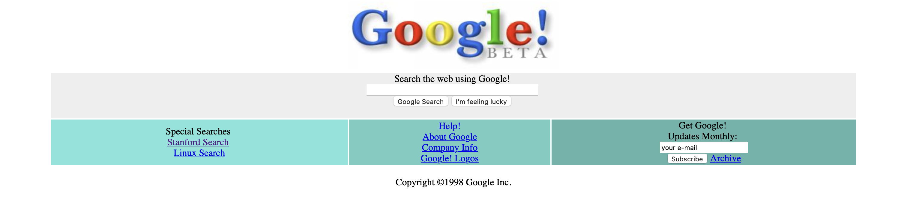

# Google98

Bu repo [CSS Ödev 2]("https://app.patika.dev/courses/css/odev2")  için tasarlanmıştır. 


## Installation
Öncelikle projeyi clonelayın. 
```
git clone https://github.com/fatih1453/Google98.git
```
## Usage
Projeyi cloneladiktan sonra Visual Studio Code programinda açiniz.
Linux için:
```
cd kodluyoruzilkrepo
code .
```
## Contributing
Pull requestler kabul edilir. Büyük degisiklikler için, lütfen önce neyi degistirmek istediginizi tartismak için bir konu açiniz.
## License
[MIT](https://github.com/fatih1453/Google98/blob/main/LICENSE)